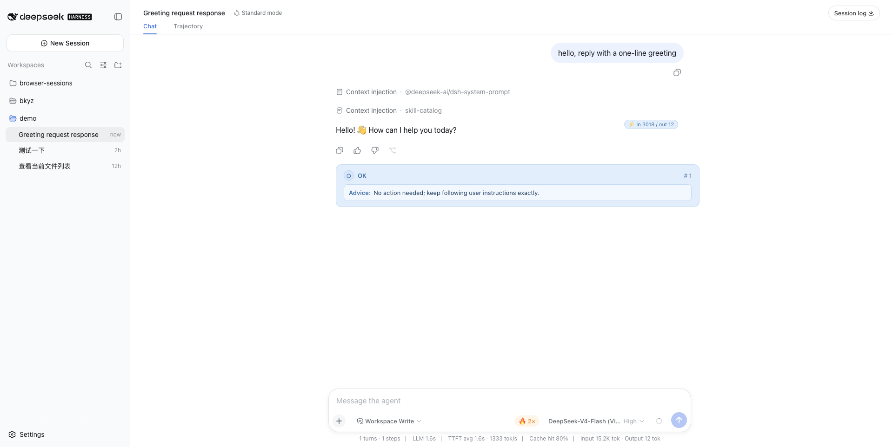

<h1 align="center">dsh-advisor</h1>

<p align="center">Turn advisor for DSH — evaluates each turn (default: on error) via LLM and renders a full-width淡蓝 advice card in the chat.</p>

<p align="center"></p>

A host+client bundle plugin for [DeepSeek Harness](https://github.com/deepseek-ai/deepseek-harness). The host half listens to `session/event` for `turn/end`, calls `ctx.llm.stream()` with a configurable prompt, and appends `advisor/eval` (log-only). The browser half registers a `ConversationNodeDefinition` for `advisor/eval` and a keyed `conversation.chat.node` renderer (`advisor`) — a full-width card in harmonious blue (#e3eefc/#3b6ea5, no traffic-light colors) with verdict icon differentiation.

## Install

```sh
dsh plugin --profile web add github:haoliangwu/dsh-advisor
```

Built `lib/` is committed, so the git install is one line — no `prepare` script, no `allowBuilds` permission. Restart `dsh --profile web` after install (bundle layer stacks compose at boot).

## Configure

In your profile's `cordis.patch.yml` (`~/.dsh/profiles/web/cordis.patch.yml`):

```yaml
- id: dsh-advisor
  config:
    # When to evaluate: ['error'] (default) or ['all']
    evaluateOn: ['error']
    # Optional explicit route; fallback is session's current model (request/header)
    provider: deepseek-official
    model: deepseek-chat
    # Optional prompt template with {turn} and {transcript} placeholders
    promptTemplate: |
      Evaluate turn {turn}...
      Transcript:
      {transcript}
```

`evaluateOn` accepts any `turn/end` reason kind (`completed`, `error`, `aborted`, `blocked`, `max-tokens`, `interrupted`) or `all`. An empty list disables evaluation.

`promptTemplate` defaults to a hard-coded JSON template that requests `{"verdict":"ok"|"needs-attention"|"off-track","issues":[],"advice":"..."}`. JSON parse failures degrade to `needs-attention` with advice set to raw output.

Disable entirely:

```yaml
- id: dsh-advisor
  disabled: true
```

## How it works

- **Host:** `ctx.on('session/event')` filters `turn/end` by `evaluateOn`; builds a short transcript from `session.deriveMessages()` (last 10) and the `requestHeader`/`requestContext` route (or explicit `provider`/`model`); calls `ctx.llm.stream()` and parses verdict/issues/advice; appends `advisor/eval` log-only (no surfaceOp, ignorable).
- **Client:** `ConversationNodeDefinition` (`kind: advisor`, `target: chat`) matches `advisor/eval` per turn and builds a `chatNode('advisor', …)`; `AdvisorCard` renders a full-width淡蓝 card with blue-family icons (○ / ◐ / ◉) and locale-aware verdict labels (`advisor` namespace, zh/en).
- **Card styling:** background `#e3eefc`, border `#c3dbf5`, text `#3b6ea5` family; icon variants differentiate verdicts within the same hue (light fill → solid fill), never red/yellow/green.

## Build from source

```sh
pnpm install
pnpm build         # emits lib/index.js, lib/invariant.js, lib/client.js + sourcemaps
pnpm typecheck     # tsc --noEmit
```

`lib/` is committed so git installs work without a build step. After changing source, run `pnpm build` and commit the updated `lib/`.

## License

MIT
